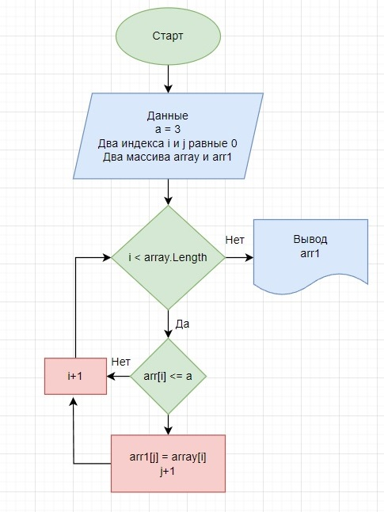

# Итоговая контрольная работа по основному блоку
## Задача
1. Создать репозиторий на GitHub
2. Нарисовать блок-схему алгоритма (можно обойтись блок-схемой основной содержательной части, если вы выделяете её в отдельный метод)
3. Снабдить репозиторий оформленным текстовым описанием решения (файл README.md)
4. Написать программу, решающую поставленную задачу
5. Использовать контроль версий в работе над этим небольшим проектом (не должно быть так, что всё залито одним коммитом, как минимум этапы 2, 3, и 4 должны быть расположены в разных коммитах)
* Написать программу, которая из имеющегося массива строк формирует новый массив из строк,
длина которых меньше, либо равна 3 символам. Первоначальный массив можно ввести с клавиатуры,
либо задать на старте выполнения алгоритма.
* При решении не рекомендуется пользоваться коллекциями,
лучше обойтись исключительно массивами.
* Примеры:
1. [“Hello”, “2”, “world”, “:-)”] → [“2”, “:-)”]
2. [“1234”, “1567”, “-2”, “computer science”] → [“-2”]
3. [“Russia”, “Denmark”, “Kazan”] → [] */

## Решение задачи
1. Ввод данных ввиде элементов массива.
2. Создание массива.
3. Создание метода заполнения массива.
4. Создание метода вывода массива.
5. Создание метода проверки элементов массива на длину ни более 3ех символов.
6. Проверка элементов массива на равентство нулю.
7. Создание нового массив отвечающего условию задачи "Формирования нового массива из строк, длина которых меньше или равна 3ем символам.
8. Вывод нового массива.

* Создание блок схемы с пошаговым описанием алгоритма данной задачи.

